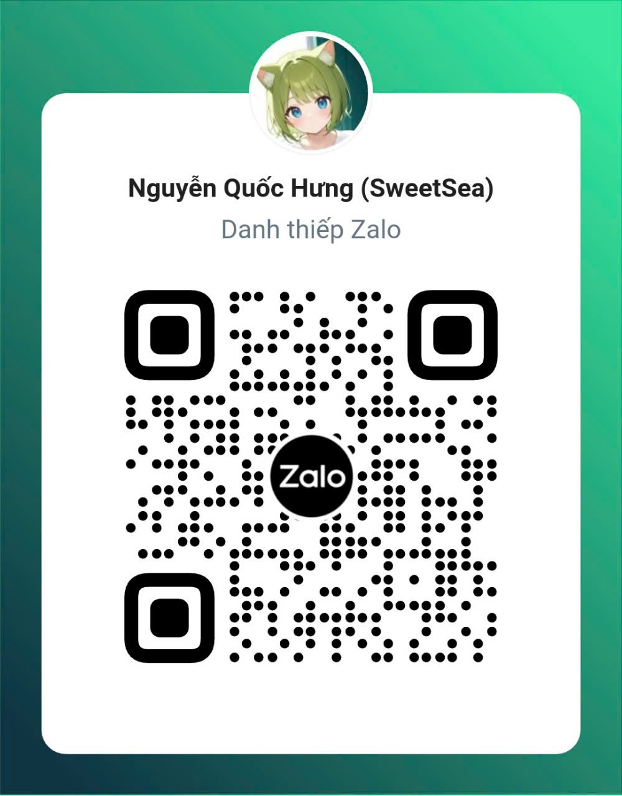

# Thông tin liên hệ
- Mọi câu hỏi không liên quan tới hướng dẫn, xin gửi về HOCMAI:
  - Zalo CSKH: https://zalo.me/3717827759646460602
  - Hotline: 1900 69 33 (có thể check lại ở trang chủ của HOCMAI)
  - Email: hotro@hocmai.vn
  - Hoặc liên hệ với chủ nhóm Zalo của khóa học tương ứng
- Đối với hướng dẫn này
  - Discord: `sweetsea`
  - Zalo: Chỉ nhắn qua Zalo nếu các bạn không dùng Discord. Mở Zalo, nhấn dấu `+` bên góc trên phải màn hình và nhấn `Quét mã QR`. Nếu trên cùng điện thoại, các bạn có thể lưu ảnh mã QR bên dưới lại, rồi khi tới bước quét mã QR, các bạn chọn mã QR từ ảnh. Bên dưới là danh thiếp Zalo của mình:   
    - ***YÊU CẦU:***
      - Chỉ nhắn tin khi cần, và suy nghĩ kĩ trước khi nhắn. **NGHIÊM CẤM troll, spam, quảng cáo, nhắn linh tinh, gọi bừa bãi, ...**
      - Đặt câu hỏi vào thẳng vấn đề chứ không chỉ nhắn mỗi `Hi!` hoặc `Xin chào` hoặc `Cho mình hỏi câu này được không?`
      - Vi phạm nhiều lần sẽ bị chặn liên hệ. Zalo với mình chỉ để trao đổi với người ngoài chứ không phải là mạng xã hội giải trí
  - Nhóm trao đổi/chụp bài/hỗ trợ việc học (KHÔNG PHẢI CỦA HOCMAI): [Máy chủ Discord](https://discord.gg/U3fTtjbXvG)