# Hướng dẫn lấy đề của buổi học trực tiếp trên HOCMAI
Một hướng dẫn cách lấy đề trên HOCMAI, viết bởi SweetSea, nhằm giải quyết triệt để luôn tình trạng bát nháo trong chat:
  - "Đề đâu?"
  - "Sao không có đề"
  - "Đề lấy ở đâu vậy hả mọi người?!"
  - "WTF sao HOCMAI không up đề lên từ trước?!?!?!"
  - "Đề đâu hả mn ơi?! Tui làm theo hướng dẫn rồi mà không thấy tài liệu, SOS!"
  - ...

> Viết bởi SweetSea | Lần cuối cập nhật: 7/2/2025

| Liên kết                    | Đây là liên kết nhảy nhanh        |
| --------------------------- | :-------------------------------- |
| [DISCLAIMER](DISCLAIMER.md) | Lời tuyên bố từ chối trách nhiệm  |
| [SOS](SOS.md)               | Đọc cái này nếu vẫn không thấy đề |
| [LIÊN HỆ](CONTACT.md)       | Liên hệ bên HOCMAI hoặc mình      |
| [NHẬT KÍ](CHANGELOG)        | Nhật kí thay đổi                  |

---

# Mục lục
- [Hướng dẫn lấy đề của buổi học trực tiếp trên HOCMAI](#hướng-dẫn-lấy-đề-của-buổi-học-trực-tiếp-trên-hocmai)
- [Mục lục](#mục-lục)
- [Hướng dẫn](#hướng-dẫn)
  - [ĐẦU TIÊN: Xác định đề](#đầu-tiên-xác-định-đề)
  - [BÂY GIỜ: đi lấy đề](#bây-giờ-đi-lấy-đề)
    - [Từ trang `Khóa học của tôi`](#từ-trang-khóa-học-của-tôi)
    - [Từ trang `Phòng luyện đề`](#từ-trang-phòng-luyện-đề)
- [Nếu bạn đã đọc đến đây rồi](#nếu-bạn-đã-đọc-đến-đây-rồi)

---

# Hướng dẫn
## ĐẦU TIÊN: Xác định đề
1. Vào https://topuni.hocmai.vn, điền số điện thoại của bạn vào. Sau khi truy cập, các bạn sẽ được lịch học của mình như sau: \
    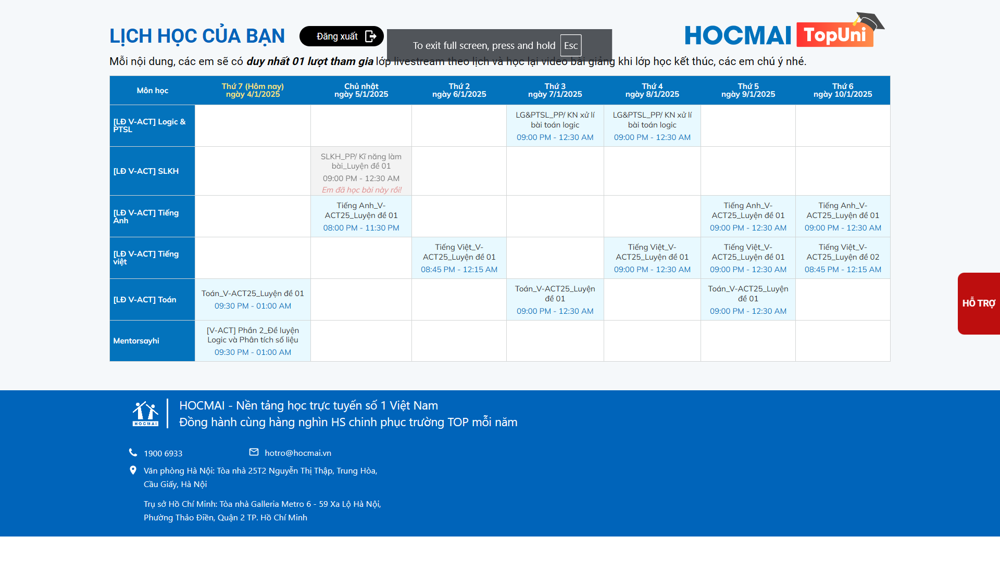
    > **GIẢ SỬ** hôm nay là thứ 6, ngày 3/1/2025, và mình muốn học buổi `Toán_V-ACT25_Luyện đề 01` (welp mình chọn khóa nào là tùy mình)
    ---
2. Xem lịch và chọn buổi bạn sẽ học tiếp theo là buổi nào. ***LƯU Ý!***
      - Mỗi bạn sẽ có lịch học khác nhau, hãy tra lịch và sắp xếp làm sao để bạn có thể học một cách thuận tiện nhất
      - Hình ở trên là làm mẫu, các bạn có thể không học khóa Luyện đề iLive V-ACT mà học khóa Luyện đề khác. Áp dụng tương đương

## BÂY GIỜ: đi lấy đề
Hiện tại có 2 cách lấy đề, từ trang `Khóa học của tôi`, hoặc từ `Phòng luyện`. Nếu đi từ trang `Phòng luyện` sẽ nhanh hơn nhưng phải biết đọc đề, và các bạn chỉ có thể làm đề trực tuyến nếu đi theo cách thứ hai

### Từ trang `Khóa học của tôi`
1. Vào trang chủ của HOCMAI (https://hocmai.vn), đăng nhập bằng thông tin mà các anh/chị tư vấn đã gửi cho các bạn ngay sau khi đăng ký
2.  - Sau khi các bạn đăng nhập xong, chọn `Khóa học của tôi` ở thanh điều hướng \
    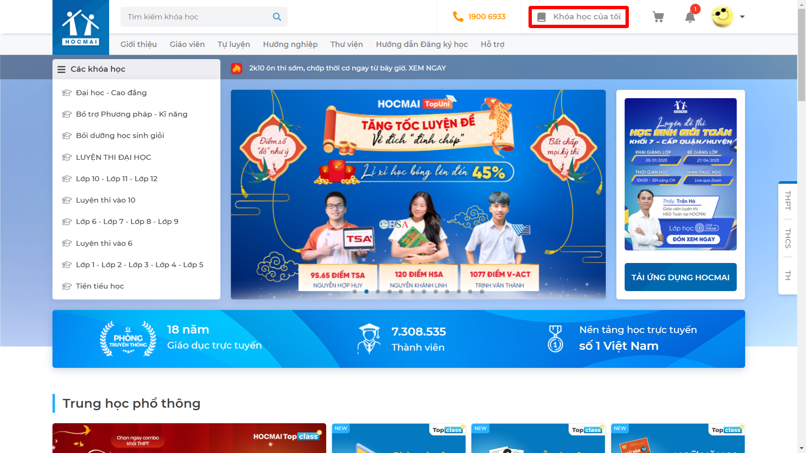
    - Các bạn sẽ thấy tất cả khóa học như này \
    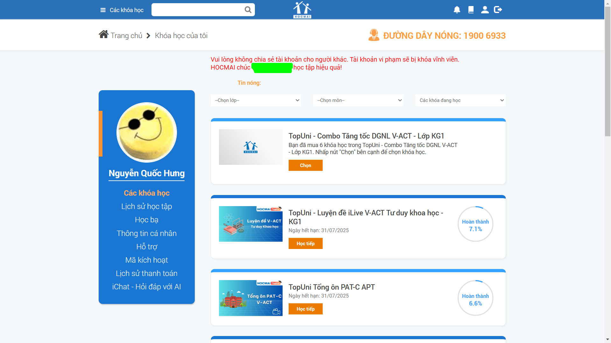
3. Ở đây, các bạn sẽ chọn môn các bạn cần lấy đề, những "khóa" nào có chữ **`Luyện đề`** tức là những "khóa" chứa đề bên trong (đồng thời cũng chứa video để xem lại cho những bài đã qua 10 ngày kể từ buổi chiếu đầu tiên). Ví dụ như hình sau, với những "khóa" chứa đề đã được khoanh đỏ \
    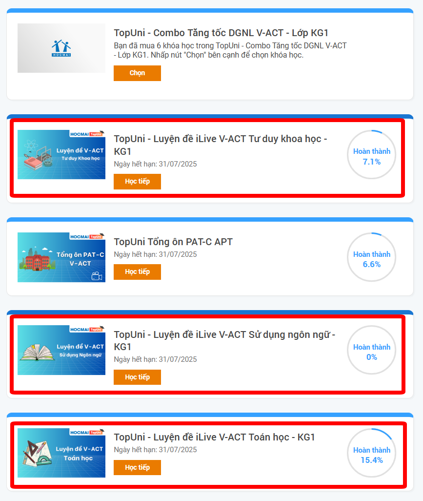 \
    Như ví dụ ở trên, mình sẽ chọn khóa thứ 3 từ trên xuống dưới
4.  - Ở thời điểm này, các bạn sẽ nhìn thấy trang như này \
    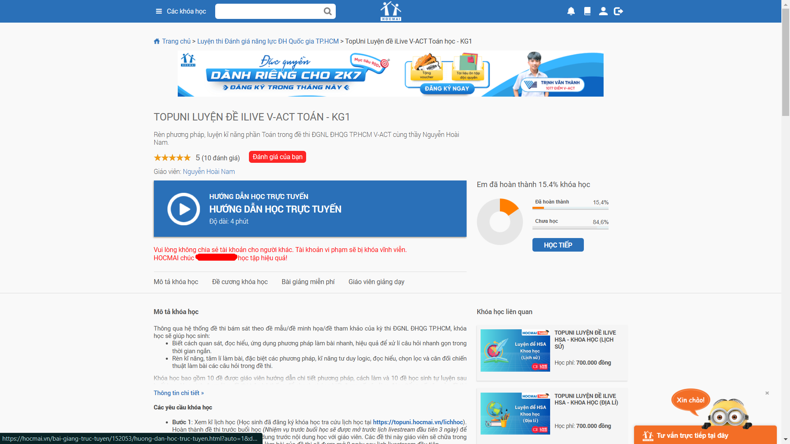
    - Tuy nhiên, với một số bạn, nhất là những bạn học buổi đầu, các bạn sẽ gặp trang này: \
    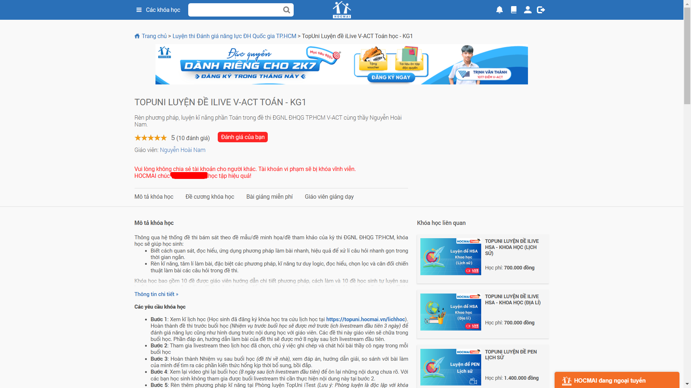
    - Các bạn hãy nhấn vào nút `Đề cương khóa học`, là nút thứ 2 trong 4 nút ở phía bên dưới dòng chữ `Vui lòng không chia sẻ tài khoản cho người khác. Tài khoản vi phạm sẽ bị khóa vĩnh viễn.` Nếu làm đúng, trình duyệt sẽ tự trượt trang tới đây: \
    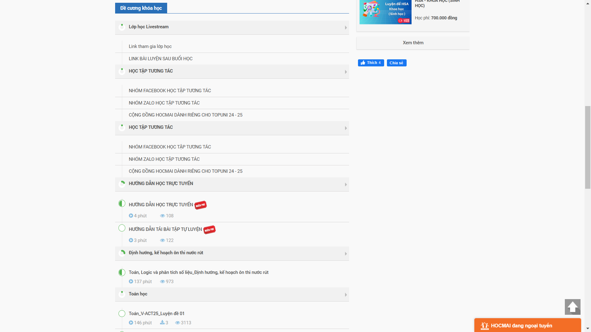
    - Từ đoạn này các bạn có thể bỏ qua 4 mục đầu tiên (có thể thôi nhá, nếu muốn thì cứ xem). Phần đó là hướng dẫn và các liên kết quan trọng mà HOCMAI gửi các bạn.
    - Sau khi trượt xuống, các bạn sẽ có thể tìm thấy bài mình cần lấy. Như ví dụ mình đang đặt: \
    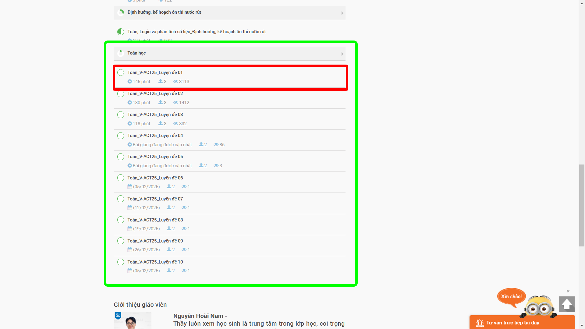
5.  - Chọn bài mà các bạn vừa tìm thấy ở bước vừa rồi. Các bạn sẽ thấy trang sau, vùng mình bôi đỏ chính là nơi lấy tài liệu về: \
    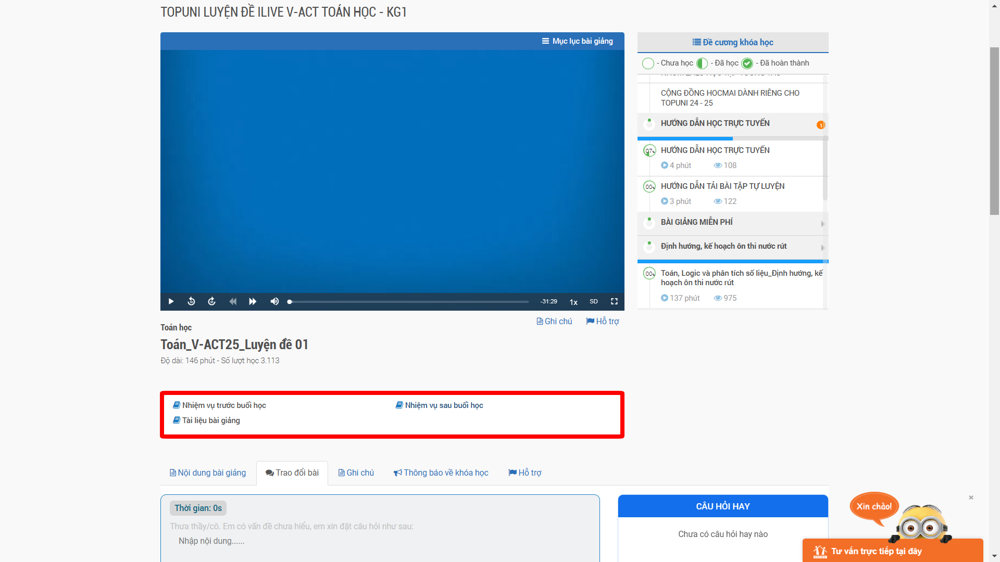
    - Thường sẽ có 3 liên kết:
      | Tên link                                          | File?                                         |
      | ------------------------------------------------- | --------------------------------------------- |
      | 1. Tài liệu trước live Nhiệm vụ trước buổi học | Đề live, đề mà thầy cô sẽ sửa trong buổi live |
      | 2. Tài liệu sau live Nhiệm vụ sau buổi học     | Đề luyện, tất nhiên là tự luyện sau buổi live |
      | 3. Tài liệu live Tài liệu bài giảng            | Đề live nhưng dạng file PDF, để in trực tiếp  |
    - ***LƯU Ý!***:
      - Một số môn có thể có 2 hoặc 3 liên kết, và các liên kết này có thể có tên khác; các bạn có thể dựa vào tên để phán đoán xem link đó sẽ đưa bạn tới tài liệu nào
      - Liên kết 1 và 2 LUÔN ***chuyển hướng các bạn vào phòng luyện của HOCMAI***.
        - Nếu các bạn bị yêu cầu hỏi đăng nhập tài khoản, cứ chọn `Đăng nhập`, phòng luyện sẽ dùng tài khoản từ hệ thống HOCMAI chính (https://hocmai.vn) để đăng nhập.
        - Sau khi đăng nhập xong, nếu các bạn bị chuyển hướng lại về trang chủ của phòng luyện thì hãy vào lại liên kết từ đầu Bước 7.
      - Nếu lỗi đề (file không tồn tại, sai đề, ...), hãy báo lại bên CSKH của HOCMAI.

### Từ trang `Phòng luyện đề`
1. Vào trang https://phongluyen.hocmai.vn, đăng nhập vào Phòng luyện (nếu cần)
2.  - Chọn `Phòng luyện đề` rồi chọn bộ đề   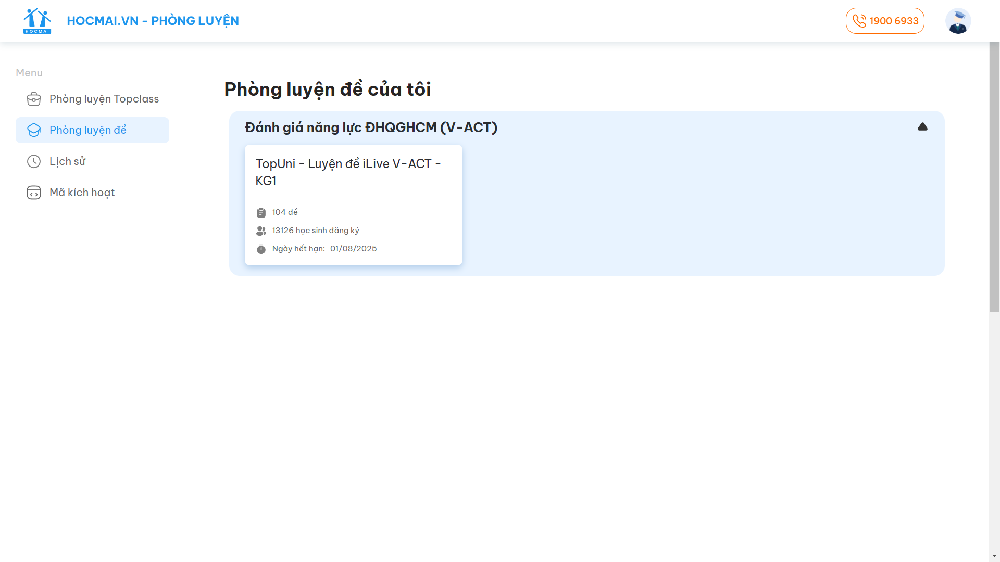
    - Sau khi chọn khóa xong, các bạn sẽ thấy màn hình này   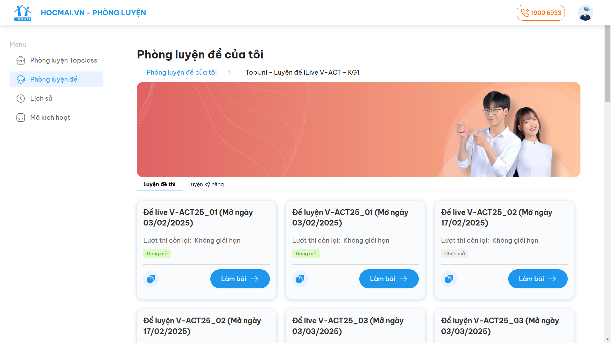
    - ***LƯU Ý***
      - Phụ thuộc vào tính chất từng khóa mà bạn chọn, các bạn có thể chỉ có đề ở mục `Luyện đề thi` hoặc `Luyện kỹ năng`
      - `Luyện đề thi` như tên gọi là luyện cả đề
      - `Luyện kỹ năng` chỉ có luyện một phần đề để luyện kỹ năng thôi, thường chứa cả đề live và đề luyện sau live
3. Tìm và chọn đề các bạn cần làm thôi. Sau khi chọn xong, một trang khác sẽ hiện ra, các bạn làm theo hướng dẫn và làm bài thôi

---

# Nếu bạn đã đọc đến đây rồi
Vài thứ linh tinh các bạn có thể cũng nên biết:
- Hãy lưu lại link này để bạn có thể share cho những đứa mù mờ cách lấy tài liệu live
- Hướng dẫn này có thể áp dụng cho những bạn nào cần tìm lại file live ***(luôn nhớ, bạn chỉ có thể xem file record của HOCMAI sau 7 ngày tính từ lần live đầu tiên)***, các bạn chỉ cần làm tới bước 6 của hướng dẫn này là hoàn thành.
- Hướng dẫn này cũng có thể áp dụng tương tự với các khóa iLive, và các khóa luyện đề khác trên HOCMAI
- Ở mỗi buổi live, các bạn cũng có thể thấy link đề tương ứng với mỗi buổi live
  > P/s: mình có ghi nhận là có vài trường hợp link ở dưới buổi live bị sai, cứ vào khóa iLive lấy file cho chắc ăn
- Các bạn được quyền phân phối lại hướng dẫn này. Tuy nhiên:
  - Nếu có chỉnh sửa, các bạn **BẮT BUỘC** phải thay thông tin liên hệ của mình bằng thông tin liên hệ của các bạn.
  - Nghiêm cấm hành vi mạo danh tác giả ban đầu.
  - Các bạn có thể lựa chọn có hay không việc ghi công tác giả ban đầu, nhưng mình khuyến khích các bạn ghi nếu có thể
  - Mình không để giấy phép vì không muốn gây khó dễ cho các bạn khi chỉnh sửa hướng dẫn này, nhưng làm ơn, hãy là một người có đạo đức và hành động có suy nghĩ.
- Hiện tại mình chấp nhận Pull Request, khuyến khích các bạn trong tương lai nếu rành cách sử dụng trang web HOCMAI thì hãy gửi mình file update
- Mọi câu hỏi về hướng dẫn này, hãy nhắn tin riêng cho mình, thông tin để ở bên dưới
- Và cuối cùng, các kênh CSKH của HOCMAI không phải chỉ để cho chơi. Những thắc mắc ngoài phạm vi của hướng dẫn này mình không trả lời, các bạn hãy mạnh dạn gửi câu hỏi của mình về bộ phận CSKH của HOCMAI.